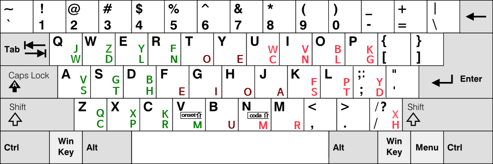

# ROS-e Keyboard
**Roman Orthographic Simultaneous-input for English**
by eekdland (Sinseiki)

*Alias: ROSE*

<p style="text-align:center">
  
</p>

ROS-e is an experimental simultaneous-input method for English.

Unlike traditional stenography systems, ROS-e does not require dictionaries, briefs, or phonetic theories for general typing. Words can be generated directly from their spelling, allowing users to type unfamiliar words, identifiers, technical terms, and newly coined words without memorizing special shorthand codes.
ROS-e can be used without a dictionary.


The project explores a different approach to English text entry:

* Orthography-based input instead of phonetic input
* Simultaneous key presses on a standard keyboard
* Direct spelling-to-output correspondence
* Dictionary-free typing for ordinary words
* Adaptive chord depth
* Onset–Nucleus–Coda structural organization
* Left-to-right ordering within each group
* Developer-friendly input for identifiers and technical vocabulary

ROS-e is inspired by Korean simultaneous-input keyboard research, particularly Semo-e and Sebeolsik-based designs.

Sebeolsik is a Korean keyboard family that separates onset, nucleus, and coda components into distinct input groups.
 
The central idea is that multiple letters can be entered together while preserving the natural spelling order of a word.

This project is currently in the **Alpha** stage as an AutoHotkey prototype. 
(The AutoHotkey code was created with the help of AI.)

The layout, grammar, and key mappings may change as practical testing continues.


The current layout was developed through repeated analysis of approximately ten million English characters, followed by practical typing experiments and iterative refinement.

---

# Why ROS-e?

Most English stenography systems achieve high compression by relying on phonetic theories, dictionaries, and memorized shorthand forms.

ROS-e explores a different direction.

ROS-e is not intended to compete directly with professional stenography systems.

Instead, it aims to provide a practical increase in typing efficiency on a standard keyboard while preserving direct correspondence between spelling and input.

The goal is to occupy a middle ground between conventional typing and full stenographic systems.

Instead of translating words into shorthand codes, ROS-e attempts to preserve the original spelling structure of English while allowing simultaneous input.

---

# Orthographic Order Preservation

ROS-e attempts to preserve the intended spelling order even when individual key presses are not perfectly synchronized.

For example:

```text
researchTeam
cambridgeUniversity
humanMind
```

A ROS-e chord is interpreted according to the intended letter order rather than the exact timing of individual key presses.

This approach may reduce a common class of typing errors known as the *[Transposed Letter Effect](https://www.mrc-cbu.cam.ac.uk/people/matt.davis/cmabridge/)*, where letters appear in the wrong order even though all required letters are present.

For software developers, mistakes such as:

```text
resaerchTeam
cambrigdeUniversity
huamnMind
```

can be surprisingly difficult to notice during code review and debugging.

By preserving orthographic order within a chord, ROS-e aims to make such errors less likely during fast typing.

---

# Design Philosophy

ROS-e is based on the following principles:

1. Spelling comes first.
2. Simultaneous input should remain readable and predictable.
3. Users should be able to type unfamiliar words without consulting a dictionary.
4. Abbreviations should be optional rather than mandatory.
5. Standard keyboards should remain usable without special hardware.

And the current ROS-e layout was not derived from existing stenography layouts.

Instead, the key arrangement was developed through repeated analysis of approximately ten million characters of English text, combined with practical typing experiments and iterative layout revisions.

The goal was not to reproduce traditional stenographic theories, but to explore a simultaneous-input system that preserves English spelling order while remaining practical on a standard keyboard.

It is not to replace stenography, but to explore a practical middle ground between conventional typing and full stenographic systems.

---

# Fingering Philosophy

ROS-e is not based on strict finger assignments.

Unlike many traditional keyboard layouts, ROS-e allows a degree of fingering flexibility in order to reduce awkward hand movements during simultaneous input.

## Shared Vowels

The vowel area is shared between both hands.

Users may choose whichever hand provides the most comfortable movement for a particular chord.

As a result, the same vowel may be entered by either the left hand or the right hand depending on the context.

## Flexible Fingering

ROS-e generally follows conventional touch-typing principles.

However, simultaneous input occasionally permits alternative fingerings when they reduce awkward hand movements or finger collisions.

The objective is practical comfort rather than strict adherence to a single fingering method.

When a chord becomes uncomfortable, users are allowed to use a neighboring finger if it produces a more natural hand motion.

The goal is to minimize unnecessary strain rather than enforce a fixed typing technique.

## Thumb Usage

The thumb is normally not required.

However, ROS-e allows occasional thumb participation when:

* a chord would otherwise cause finger collisions,
* a longer finger would need to bend excessively,
* or an alternative movement is significantly more comfortable.

Thumb usage is therefore optional and situational rather than mandatory.

## Practical Ergonomics

ROS-e prioritizes practical comfort over theoretical finger assignments.

If multiple fingerings are possible, users are encouraged to choose the one that produces the most natural movement while preserving the intended spelling order.

---

# Onset Shift and Coda Shift

ROS-e introduces two mechanisms called **Onset Shift** and **Coda Shift**.

Because English contains 26 letters but simultaneous input requires multiple positional groups, letters are separated into three functional categories:

* Onset
* Nucleus
* Coda

ROS-e reconstructs words by processing Onset, Nucleus, and Coda groups separately. Left-to-right ordering is applied within each group rather than across the entire chord.

Onset Shift and Coda Shift expand the effective capacity of the Onset and Coda groups.

This allows ROS-e to represent a larger set of letters than would otherwise fit within the available key positions while preserving the Onset–Nucleus–Coda structure and orthographic order.

---

# Vowel Design

English contains many common multi-letter vowel combinations, such as:

```text
ee
ea
oo
ou
ie
oi
```

To support these patterns efficiently, ROS-e uses duplicated vowel positions for certain vowels.

This design allows common vowel combinations to be entered naturally while maintaining orthographic consistency.

---

# Modifiers and Shortcuts

ROS-e does not introduce a separate mechanism for capitalization or system shortcuts.

When Shift, Ctrl, Alt, or Win is pressed, ROS-e temporarily falls back to the underlying keyboard layout.

As a result, users can continue to use familiar keyboard behavior without learning additional shortcut rules.

For example:

* Shift + letter → capital letter
* Ctrl + C → copy
* Ctrl + V → paste
* Ctrl + Z → undo
* Alt + Tab → task switching
* Win + R → Run dialog
* Win + E → File Explorer

This approach allows ROS-e to coexist with existing operating-system and development-tool workflows while minimizing interference with established shortcuts.


---

# Enabling and Disabling ROS-e

ROS-e uses Scroll Lock as its primary mode switch.

* Scroll Lock ON → ROS-e enabled
* Scroll Lock OFF → ROS-e disabled
* F9 → Alternative toggle key

The Scroll Lock indicator can therefore be used as a visual status indicator for ROS-e.

When ROS-e is disabled, all keys behave normally according to the active keyboard layout.

---

# Punctuation

Some ROS-e letter assignments occupy positions normally used by punctuation keys.

As a result, punctuation may require modifier-based input.

For example:

* Shift + ; → ;
* Shift + ; twice → :
* Shift + / → /
* Shift + / twice → ?

The exact behavior may change during future development.

---

# Future Plans

ROS-e is designed to remain fully usable without dictionaries or shorthand systems.

Future development may explore additional productivity features, experimental input methods, or optional extensions.

The exact direction of future development has not yet been finalized.

---

# Conclusion

ROS-e can be viewed as a simultaneous orthographic input system that occupies a middle ground between conventional typing and traditional stenography.

---

# Related Projects

* [Semo-e Keyboard (Korean)](https://github.com/Sinseiki/Semo-e_keyboard) — A Korean simultaneous-input keyboard project that inspired ROS-e.